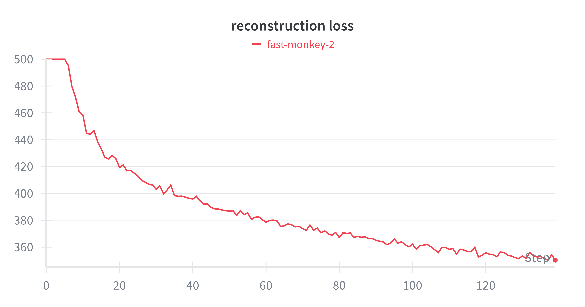
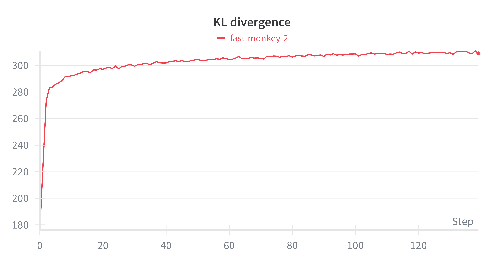
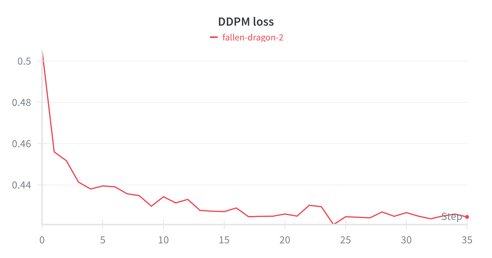
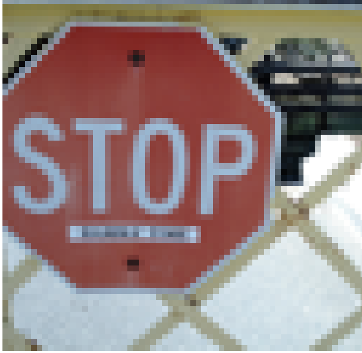
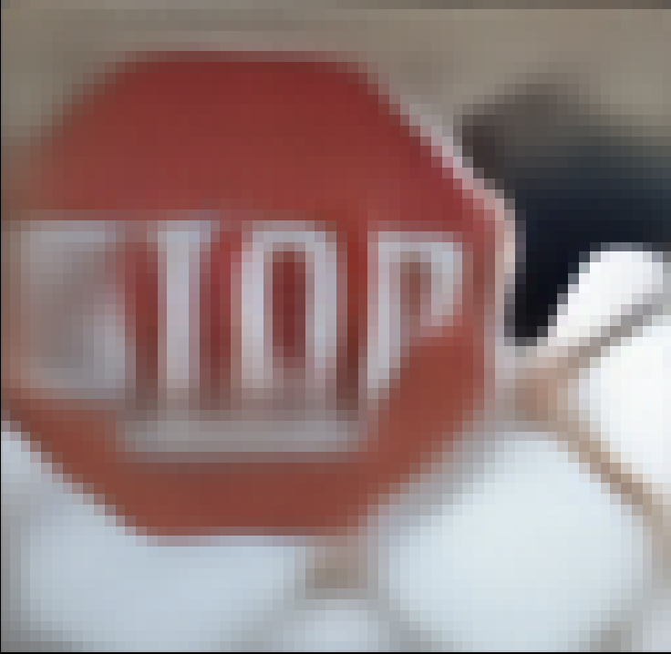
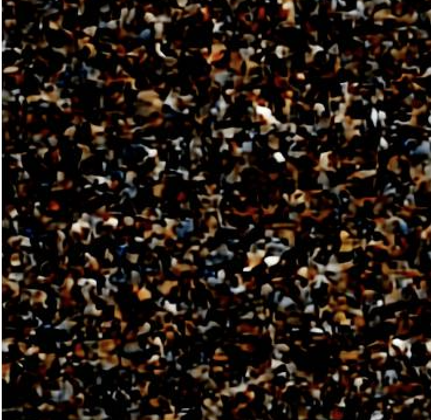
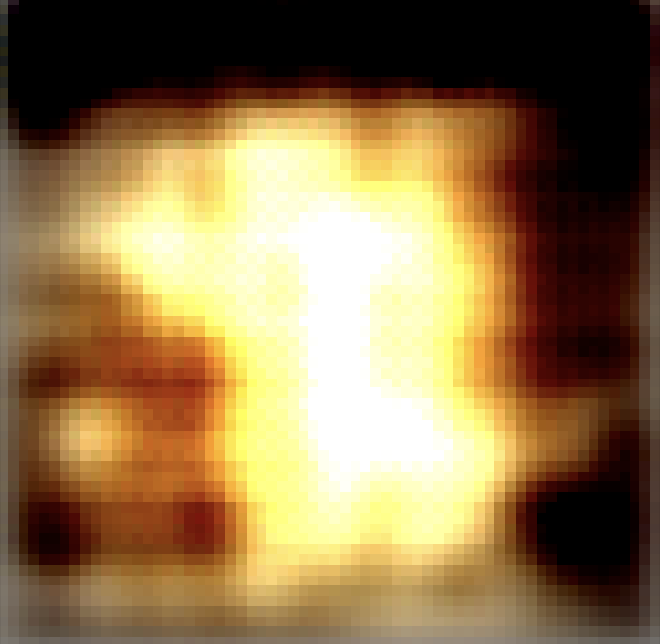

# Latent Diffusion Model with Classifier-Free Guidance

A PyTorch implementation of a text-to-image diffusion model that operates in latent space using a Variational Autoencoder (VAE), with support for Classifier-Free Guidance (CFG) training and inference.

## Features

- **Latent Space Diffusion**: Efficient generation in compressed VAE latent space
- **Text Conditioning**: CLIP-based text encoding for text-to-image generation
- **Classifier-Free Guidance**: Improved sample quality through CFG training and inference
- **Modular Architecture**: Separate VAE and diffusion model training
- **COCO Dataset Support**: Built-in dataloader for MS-COCO dataset
- **Progressive Sampling**: Visualization of denoising process
- **Mixed Precision Training**: Optimized training with automatic mixed precision

## Architecture

### Core Components

1. **VAE (Variational Autoencoder)**
   - Encoder: Downsamples 64×64 images to 8×8 latents
   - Decoder: Reconstructs images from latent representations
   - ResNet blocks with self-attention layers
   - KL divergence regularization

2. **U-Net Diffusion Model**
   - Conditional U-Net architecture with cross-attention
   - CLIP text embeddings as conditioning
   - Timestep embedding with sinusoidal encoding
   - Multi-head attention for text-image alignment

3. **CLIP Text Encoder**
   - Pre-trained CLIP text model for semantic understanding
   - Supports variable-length captions with attention masks
   - Unconditional embedding generation for CFG

4. **DDPM (Denoising Diffusion Probabilistic Model)**
   - Cosine noise scheduling
   - Classifier-free guidance implementation
   - Progressive sampling with intermediate visualization

## Training Pipeline

1. **VAE Training**
  - Reconstruction loss + KL divergence
  - ~20 epochs on COCO dataset
  - Enables efficient latent space operations

2. **Diffusion Training**
  - Frozen VAE, trainable U-Net
  - CFG dropout for unconditional learning
  - Cross-attention with CLIP embeddings

3. **Inference**
  - Classifier-free guidance for improved quality
  - Progressive denoising visualization
  - Flexible text conditioning

## Loss visualization

## Visual Result

### VAE

#### Original vs Reconstruction
**Original Image**  

**Reconstruction**  

#### Latent Space Sampling
**Generated from VAE Latent Space**  

### Diffusion Model (DDPM)

#### Current Results & Analysis
Unfortunately, DDPM sampling currently captures only colors and basic shapes and is not yet optimal. This is likely due to:
- Limited training updates on a relatively large dataset (120k images)
- Training constraints on RTX 3090
- Need for longer training as loss continues to decrease
- Potential improvement with perceptual loss addition

#### Generated Sample
**Prompt:** "A man eating a pizza"  

